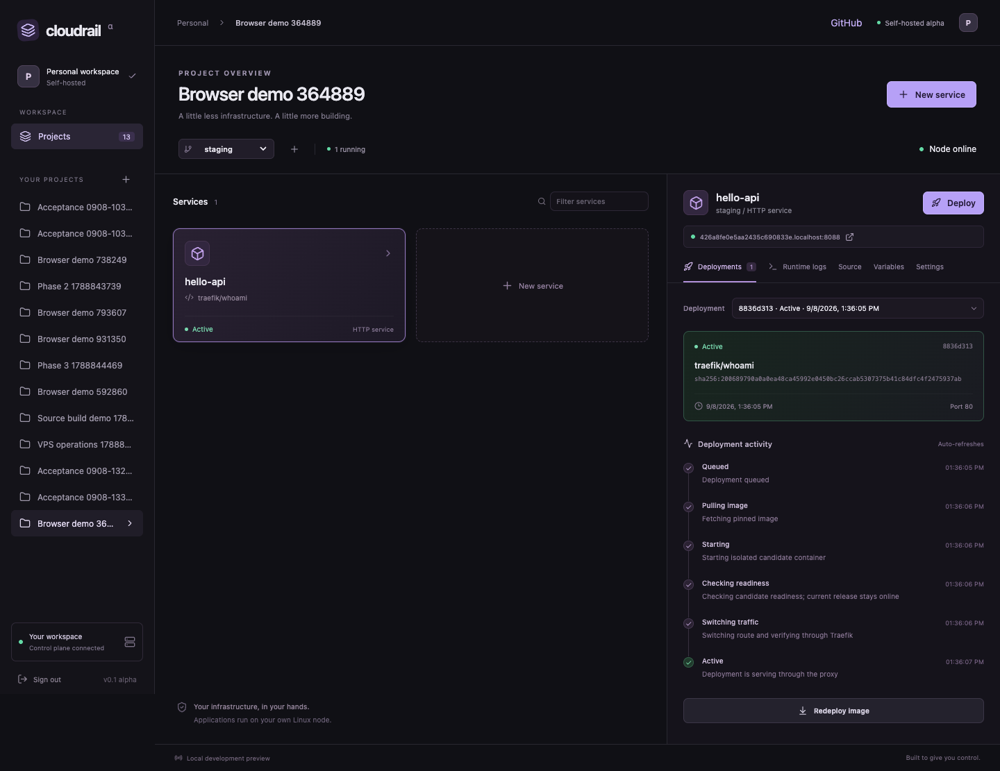
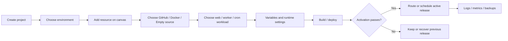

<div align="center">

# Cloudrail

**Deploy on your own server. Keep the workflow simple.**

An open-source, self-hosted deployment platform with a Railway-inspired workspace, a Go control plane, and a React dashboard.

[](https://github.com/MinnKhantThuu/cloudrail/actions/workflows/verify.yml)
[](LICENSE)
[](docs/release.md)

[Getting started](#quickstart) · [User guide](docs/user-guide.md) · [မြန်မာလမ်းညွှန်](docs/guide-my.md) · [Architecture](docs/architecture.md) · [Railway-inspired plan](docs/railway-parity-plan.md) · [Roadmap](docs/ROADMAP.md)

</div>



## What is Cloudrail?

Cloudrail turns a Linux Docker server into a workspace for deploying your applications. Group services into projects and environments, deploy a container image or build from GitHub, watch logs, and manage private PostgreSQL/Redis/MySQL data services and persistent storage from the dashboard.

Inspired by the developer experience of Railway and the self-hosting model of Coolify, Cloudrail uses original application code and UI. It is not affiliated with either project.

**Status: early alpha (`0.1.0-alpha.4`).** Designed for **one owner, one Linux node and trusted repositories**. The Railway-inspired canvas supports GitHub/Docker/empty sources, web services, route-free workers, recoverable cron jobs, deployment commands, restart policies, versioned PostgreSQL/Redis templates, first-class volumes, portable Redis/application-volume backups and S3-compatible bucket connections. MySQL is implemented in UX-4.5a and awaiting hosted runtime proof. The public Linode still runs the alpha.4 dashboard and has not received this canvas yet. Public source availability does not mean production readiness. See the [product plan](docs/railway-parity-plan.md) and [verification](docs/verification-current.md).

## Features

| Area | Included in this alpha |
| --- | --- |
| Workspace | Owner sign-in, projects/environments, pan/zoom canvas, persisted nodes and resource drawers |
| Compute | GitHub/Docker/empty sources with web, background-worker and UTC cron workloads |
| Deployment | Digest-pinned images, readiness, start/pre-deploy commands, restart policies, history, cancellation and recovery |
| Source builds | GitHub repository/branch configuration, Dockerfile and Railpack, build logs |
| GitHub integration | Encrypted App credentials, signed push handlers and delivery deduplication |
| Configuration | Encrypted runtime variables, CPU/RAM limits and custom hostname settings |
| Persistent workloads | Named volumes, private PostgreSQL/Redis services, pending-proof MySQL, S3-compatible buckets and hidden application connection bindings |
| Operations | Container logs, node heartbeat, observed metrics, backup downloads and empty-target restore |
| Installation | Local Docker Compose, provider-neutral Ubuntu VPS installer, Linode pilot runbook and optional AWS Lightsail template |

Multi-user teams/RBAC, hostile multi-tenancy, billing, multi-node scheduling, autoscaling and Kubernetes are outside the current scope.

Versioned packages: [GitHub Releases](https://github.com/MinnKhantThuu/cloudrail/releases) — source, Linux amd64/arm64 archives and checksums, with verified build provenance.

## Quickstart

### 1. Check requirements

- A running **Linux Docker Engine with API 1.47+** and Docker Compose (plugin or standalone).
- Git and OpenSSL on the host. Go/Node are not required for the Docker quickstart.
- At least **4 GB RAM** and **8 GB free Docker disk**; 20 GB free is preferable for source builds.
- Available loopback ports **8080** (dashboard), **8088** (applications) and **5001** (registry).

On macOS, start Docker Desktop or Colima with a Linux VM meeting those requirements. The VPS installer targets Ubuntu 24.04/26.04 on amd64/arm64; clean-host verification is still pending.

### 2. Clone and start

```sh
git clone --branch v0.1.0-alpha.4 --depth 1 https://github.com/MinnKhantThuu/cloudrail.git
cd cloudrail
bash scripts/dev-up.sh
```

The first run builds Cloudrail's images, starts the platform services and generates private installation credentials in `deploy/local/.env`.

### 3. Create the owner account

Open **[localhost:8080](http://localhost:8080)** and choose your email and password on **Create your account**. Confirm the password and you are signed in immediately. Subsequent visits use **Sign in** with email/password. No setup token or default password is needed. Passwords must be 12–72 bytes.

On a public VPS, create the owner account immediately after installation: the first person to register owns the installation. Registration closes automatically after that first account.

Keep `.env` private and backed up: it includes the encryption key required to recover saved variables and GitHub App credentials. Do not commit it.

### 4. Deploy your first application

Pull a small sample image and obtain its immutable digest:

```sh
docker pull traefik/whoami:v1.11.0
docker image inspect traefik/whoami:v1.11.0 --format '{{index .RepoDigests 0}}'
```

In the dashboard:

1. Create a **project** and select its **production** environment.
2. Choose **New resource → Docker Image**, keep workload **Web / API**, and name it `hello`.
3. Choose **Deploy**, paste the returned `repository@sha256:...`, set port **80** and readiness path **/**.
4. Wait for **Active**, then open the service URL: `http://<service-id>.localhost:8088`.

For clients without wildcard localhost support, request `http://127.0.0.1:8088` with `Host: <service-id>.localhost`. To deploy your own source instead, follow [GitHub builds](docs/user-guide.md#deploy-from-github).

## Project flow



A **project** groups related resources. An **environment** separates configuration and deployment state, for example staging and production. A compute service can be a public web/API process, route-free worker or scheduled cron job. A **deployment** records one release attempt and its configuration snapshot. A **build** turns one source commit into an image before deployment begins.

HTTP services without shared storage use candidate readiness before switching traffic. Persistent services stop their previous container before starting a replacement to avoid concurrent writers. **Image rollback does not undo database migrations or changes to stored data.** See the [full user guide](docs/user-guide.md).

## Install on a VPS

For a public server, use the [Ubuntu installation runbook](docs/vps-operations.md). It covers DNS, wildcard app domains, firewall ports, owner setup, automatic HTTPS configuration and backup requirements. Do not expose the local preview ports directly as a public installation.

The first public target follows the [Linode pilot runbook](docs/linode-pilot.md). For AWS later, use the [Lightsail pilot runbook](docs/aws-pilot.md). Cloudrail's local quickstart creates no provider resources.

## Daily operations

```sh
# Inspect platform services and recent logs.
bash scripts/compose.sh ps
bash scripts/compose.sh logs --tail=50 server agent

# Stop the platform without deleting its persistent state.
bash scripts/dev-down.sh

# Start the existing platform without rebuilding images.
bash scripts/compose.sh up -d --no-build --wait
```

Application containers are managed separately from Compose. Stopping the platform leaves those containers and their data in place; application access still needs the proxy running. Use a service's **Settings → Stop** to stop that workload. Never remove named volumes as a routine restart step.

## Documentation

| Guide | What it covers |
| --- | --- |
| [User guide](docs/user-guide.md) | First deployment, GitHub, environments, variables, databases, backups and recovery |
| [မြန်မာအသုံးပြုလမ်းညွှန်](docs/guide-my.md) | Installation မှ deployment/backup အထိ မြန်မာလို အဆင့်ဆင့် |
| [Architecture](docs/architecture.md) | Components, trust boundaries and execution flow |
| [GitHub builds](docs/source-builds.md) | App setup, permissions, source configuration and builder limits |
| [VPS operations](docs/vps-operations.md) | Public install, domains/TLS, storage and disk retention |
| [Linode pilot](docs/linode-pilot.md) | Selected public target, access handoff and live validation checklist |
| [AWS pilot](docs/aws-pilot.md) | Optional Lightsail account planning and template |
| [Troubleshooting](docs/troubleshooting.md) | Setup, build, routing, node, storage and backup failures |
| [API](docs/api.md) | Owner endpoints and private node protocol |
| [Verification](docs/verification-current.md) | Recorded checks and unverified boundaries |
| [Release/update guide](docs/release.md) | Packaging, update, recovery and alpha limitations |
| [Railway-inspired product plan](docs/railway-parity-plan.md) | Feature inventory, target resource model, canvas flow and UX-0 through UX-9 delivery order |
| [Roadmap](docs/ROADMAP.md) | Canonical phase plan and progress |

## Development and contribution

Use **Go 1.26.8** and **Node 22.20+** with the committed npm lockfile.

```sh
go test -race ./...
go vet ./...
npm ci --prefix apps/web
npm run build --prefix apps/web
```

Database integration and real Docker/browser checks have additional setup: see [verification](docs/verification-current.md). Create local source/runtime archives with [release tooling](docs/release.md). Published source is installable through Docker; prebuilt hosted Cloudrail container images are not currently provided.

Read [CONTRIBUTING.md](CONTRIBUTING.md), report reproducible bugs in [Issues](https://github.com/MinnKhantThuu/cloudrail/issues), and use the private reporting instructions in [SECURITY.md](SECURITY.md) for vulnerabilities.

## License

[Apache-2.0](LICENSE). [Third-party components](THIRD_PARTY_NOTICES.md) retain their licenses. No Railway or Coolify source or branding assets are included.
