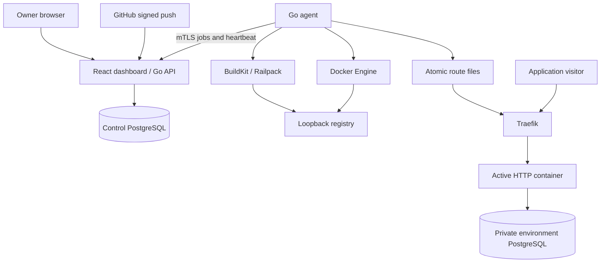

# Architecture — current alpha

Go keeps API/agent in small compiled processes with direct Docker/HTTP integration. React/TypeScript owns the interactive workspace. PostgreSQL stores durable jobs without a separate queue server. BuildKit runs separately because builds need different resources. Traefik keeps the control API out of application traffic.

This is an engineering choice, not a measured claim that Laravel always consumes excessive RAM. Local idle measurements were roughly 8 MB each for API/agent and 211 MB for all core containers, excluding apps/build peaks. Compare complete workloads before making cost claims.

## Deployment and ownership

One installation has one owner and one trusted node. Services belong to project environments. PostgreSQL is private; application bindings save encrypted connection variables without reading passwords back.

The API transaction stores immutable image/resource/variable/readiness snapshots. Each agent claim gets an attempt token and deadline; stale attempts cannot activate. An HTTP replacement pulls/starts a candidate, checks readiness, atomically writes routes, verifies the selected release through the proxy, commits activation and retires the old container. Failure restores the old route. A persistent service stops its previous writer first; image rollback cannot revert stored data.

A source build snapshots a GitHub SHA, validates its archive, runs BuildKit and publishes a digest. The server durably converts success into one deployment. Webhook HMAC and delivery deduplication happen before enqueue. Build cancellation kills the child process group.

## Persistence and boundaries

Control database, encryption key, CA/node identity, routes, registry, application volumes, backup files, ACME certificates and BuildKit cache have distinct ownership. A database dump alone cannot restore the complete installation. See [operations](vps-operations.md) and [release recovery](release.md).

Migrations are append-only, checksum-tracked and transactionally locked. Agent reconciliation repairs desired containers/routes after restart, cleans failed/superseded containers and preserves stopped services/volumes. An API outage does not intentionally stop serving apps. The node remains a single point of failure.

Docker socket access and privileged BuildKit require trusted operators/source. Builds never receive runtime variables, App keys or installation secrets. Environment networks are useful isolation, not a hostile-code sandbox. Public customer execution, teams/RBAC, remote nodes, autoscaling, unattended database major upgrades, scheduled off-server backup and arbitrary build-time secrets are outside this alpha.
