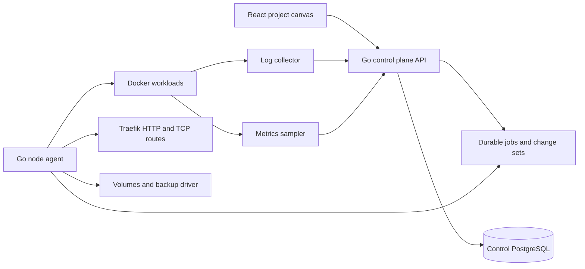

# Cloudrail — Railway-inspired product and delivery plan

Updated: 2026-09-09  
Status: **UX-0 through UX-3 and UX-4.1 through UX-4.5a are implemented and verified; UX-4.5b MongoDB is next.**

ဒီစာတမ်းက Cloudrail ကို “service card နှစ်မျိုးပါတဲ့ dashboard” အဖြစ်မတည်ဆောက်ဘဲ Railway လို **project canvas ကနေ application stack တစ်ခုလုံးဆောက်၊ ချိတ်၊ deploy နဲ့ operate လုပ်နိုင်တဲ့ self-hosted PaaS** အဖြစ်ပြောင်းရန် canonical feature plan ဖြစ်သည်။ Phase အစဉ်နဲ့ overall progress ကို `ROADMAP.md` ကပဲ ဆက်ထိန်းမည်။

## 1. Railway ရဲ့ product model ကို အရင်မှန်အောင်ယူခြင်း

Railway မှာ database ကို application နဲ့လုံးဝကွဲတဲ့ runtime မျိုးအဖြစ် hard-code မထားပါ။ အခြေခံ model က **service = deployment target** ဖြစ်ပြီး service တစ်ခုမှာ source, build, deploy, variables, networking, volume, metrics နဲ့ deployment history ရှိသည်။ PostgreSQL, MySQL, Redis, MongoDB စတာတွေက preconfigured service templates ဖြစ်သည်။

Railway ရဲ့ project canvas က project ရဲ့ default view ဖြစ်ပြီး environment တစ်ခုအတွင်းက resources ကိုတစ်နေရာတည်းမှာပြသည်။ Resource ကိုနှိပ်မှ service panel ကိုဖွင့်သည်။ Volume ကို command palette သို့မဟုတ် canvas context menu ကနေဖန်တီးပြီး service နဲ့ attach လုပ်နိုင်သည်။ Reference variables က service နှစ်ခုကြား dependency ကိုဖော်ပြနိုင်သည်။

Official references:

- [Projects and project canvas](https://docs.railway.com/projects)
- [Services and service creation](https://docs.railway.com/services)
- [Build and deploy primitives](https://docs.railway.com/build-deploy)
- [Databases and templates](https://docs.railway.com/databases)
- [Environments and staged changes](https://docs.railway.com/environments)
- [Variables and reference variables](https://docs.railway.com/variables)
- [Networking and domains](https://docs.railway.com/networking)
- [Volumes and backups](https://docs.railway.com/volumes)
- [Storage buckets](https://docs.railway.com/storage-buckets)
- [Logs and metrics](https://docs.railway.com/observability/logs)

## 2. Railway feature inventory နဲ့ Cloudrail target

| Product area | Railway behavior | Cloudrail လက်ရှိ | Cloudrail target |
| --- | --- | --- | --- |
| Project canvas | Project default view; resource nodes ကိုရွေးပြီး configure | Service card grid + detail အမြဲဖွင့် | Pan/zoom/drag canvas; node click မှ drawer ဖွင့် |
| Create flow | Canvas `New`, command palette, context menu | HTTP application / PostgreSQL modal | Source/type ခွဲထားသော create palette |
| Compute | Persistent service, worker, cron, function | HTTP long-running service | Web/API, worker, cron; function ကို later phase |
| Source | GitHub repo, Docker image, empty service, local CLI | GitHub + Dockerfile/Railpack build နှင့် pinned image ရှိပေမယ့် flow ကွဲ | Create အချိန်မှာ GitHub/Docker Image/Empty ကိုရွေး |
| Build | Railpack or Dockerfile, root directory, commands | Railpack/Dockerfile, repo, branch, root, overrides ရှိ | Service panel ထဲ Build section တစ်ခုတည်းဖြင့်ပြည့်စုံစေ |
| Deployment | Build/deploy states, healthcheck, history, rollback/actions | Queue, readiness, traffic switch, failed candidate preservation ရှိ | State names/UX ကိုတစ်သမတ်တည်းလုပ်ပြီး per-deploy logs/actions ထည့် |
| Databases | Postgres, MySQL, Redis, MongoDB and custom templates | PostgreSQL hard-coded | Template ကနေ service + volume + generated credentials ဖန်တီး |
| Volumes | Canvas resource; service တစ်ခုနဲ့ attach; backup/restore | Service setting ထဲ mount path တစ်ခု | First-class volume node + attachment edge + backup panel |
| Buckets | Private S3-compatible project resource | မရှိ | S3-compatible bucket connection/provisioning; credentials reference |
| Variables | Service/shared/reference/sealed variables; staged apply | Encrypted service variables + DB binding | Plain/secret/reference variable model + dependency edges |
| Private network | Environment-scoped internal DNS | Docker network field ရှိ | Stable internal hostname + visible actual dependency links |
| Public network | Generated/custom HTTP domain, TLS, target port; TCP proxy | HTTP hostname + Traefik TLS | Generated/custom HTTP domain first; TCP exposure later |
| Environments | production, persistent staging, duplicate/sync, PR env | production + empty environment create/switch | Duplicate/sync and staged diff; PR env later |
| Observability | Build/deploy logs, environment log explorer, CPU/RAM/disk/network metrics | bounded deployment logs + point-in-time CPU/RAM | Time-series metrics and searchable service/environment logs |
| Operations | Start/stop/restart/redeploy, resource config | ရှိ | Node drawer ထဲက Deployments/Variables/Metrics/Settings အဖြစ်စု |
| Templates | One-click multi-service stacks | မရှိ | Versioned manifest ဖြင့် service/database/volume/link အစုလိုက်ဖန်တီး |
| CLI / config as code | link/up/logs/variables and railway.toml | installer/maintenance scripts only | `cloudrail` CLI and `cloudrail.toml` later |
| Team/billing/global regions | SaaS account, usage billing, multi-region/replicas | Single owner/single node | ပထမ self-hosted release scope မဟုတ် |

## 3. Target canvas UX

Project ကိုဖွင့်လိုက်တာနဲ့ detail panel မပွင့်သေးဘဲ environment canvas အပြည့်မြင်ရမည်။

```text
┌ Project / Environment ──────────────────────────────────────┐
│ production ▾   Observability   Activity       Create +       │
├──────────────────────────────────────────────────────────────┤
│                                                              │
│   [ Frontend ] ─reference→ [ Backend API ] ─reference→ [ PG ]│
│                                  │                           │
│                              [ Worker ]                      │
│                                  │                           │
│                              [ Redis ]      [ Bucket ]        │
│                                                              │
│         drag canvas · zoom · fit · right-click create        │
└──────────────────────────────────────────────────────────────┘
```

### Canvas interaction

- Blank area drag = pan; wheel/buttons = zoom; `Fit` = resources အားလုံးကိုပြန်မြင်ရခြင်း။
- Resource node drag = layout နေရာပြောင်းပြီး server-side persist လုပ်ခြင်း။
- Node click = right-side drawer; URL/navigation state ထဲ resource id ထည့်ထားလို့ refresh/back အလုပ်လုပ်ရခြင်း။
- Blank canvas right-click, `Create +`, `Cmd/Ctrl + K` သုံးခုလုံးက create palette တစ်ခုတည်းဖွင့်ခြင်း။
- Edge ကို actual volume attachment သို့မဟုတ် reference variable ရှိမှသာဆွဲခြင်း။ အလှဆင်ဖို့ fake connection မဆွဲရ။
- Node မှာ resource type, source/template, deployment state, public/private address, pending change ကိုအတိုချုံးပြခြင်း။
- Desktop တွင် drawer က canvas ပေါ် overlay; mobile တွင် full-screen resource sheet ဖြစ်ခြင်း။

### Create palette

```text
Compute
  GitHub Repository        Docker Image        Empty Service
  Background Worker        Cron Job

Data
  PostgreSQL               Redis               MySQL
  MongoDB                  Custom database template

Storage
  Volume                   S3-compatible Bucket

Later
  Function                 Template / Compose import
```

GitHub/Docker/Empty က resource type မဟုတ်ဘဲ **source type** ဖြစ်သည်။ Web/worker/cron က **workload mode** ဖြစ်သည်။ PostgreSQL/Redis စတာက template ကသတ်မှတ်တဲ့ **service preset** ဖြစ်သည်။ ဒီအလွှာတွေကို data model မှာမရောရ။

### Node drawer

Compute service အတွက်:

1. **Deployments** — current deployment, history, build/deploy logs, redeploy/rollback/abort။
2. **Variables** — plain, secret, reference variables; raw editor; pending indicator။
3. **Metrics** — CPU, RAM, network, disk time-series။
4. **Settings** — source/build, start/pre-deploy command, healthcheck, restart policy, workload mode/cron, domain/network, resources, volume, danger zone။

Database template အတွက် credentials/data/connect/backups ကိုထည့်ပြမည်။ Volume အတွက် mount/usage/backups/restore၊ Bucket အတွက် endpoint/credentials/CORS/connection variables ကိုပြမည်။

## 4. Cloudrail resource model

လက်ရှိ `services.settings.kind = http | postgres` ကို feature အသစ်တိုင်းထပ်ပေါင်းသည့် enum အဖြစ်မတိုးရ။ အောက်ပါ responsibility အလိုက်ခွဲမည်။

| Model | အဓိက fields / responsibility |
| --- | --- |
| `services` | project, environment, name, workload mode, desired state |
| `service_sources` | `github`, `image`, `empty`; repo/image/build configuration |
| `service_templates` | postgres/redis/mysql/mongo preset, image, ports, defaults, generated variables |
| `deployments` | immutable source revision/image digest, lifecycle, active candidate/history |
| `volumes` | capacity, host path/driver, backup policy |
| `volume_attachments` | volume → service, mount path; one active writer constraint |
| `buckets` | S3-compatible provider/endpoint/region; encrypted credentials |
| `variables` | plain/secret/reference; environment/service scope |
| `resource_links` | real reference/attachment dependency used by canvas edges |
| `canvas_layouts` | project + environment + resource key + x/y coordinates |
| `change_sets` | pending config changes, diff, apply/cancel state |
| `metric_samples` / `log_entries` | bounded time-series/resource logs with retention |

API က UI ကို database rows ခွဲပို့မည့်အစား environment canvas projection တစ်ခုထုတ်ပေးမည်:

```json
{
  "project": { "id": "...", "name": "Shop" },
  "environment": { "id": "...", "name": "production" },
  "resources": [
    { "key": "service:api", "type": "service", "mode": "web", "status": "active" },
    { "key": "service:postgres", "type": "database", "template": "postgres", "status": "active" },
    { "key": "volume:pg-data", "type": "volume", "status": "attached" }
  ],
  "links": [
    { "from": "service:api", "to": "service:postgres", "kind": "variable-reference" },
    { "from": "volume:pg-data", "to": "service:postgres", "kind": "volume-attachment" }
  ]
}
```

## 5. Runtime architecture



- Control plane က desired state, resources, links, history နဲ့ secrets ကိုထိန်းမည်။
- Agent က privileged host action ကို narrow commands ဖြင့်သာလုပ်မည်။
- Web/API/worker က long-running container ဖြစ်ပြီး cron က schedule ရောက်မှ container run တစ်ခုစမည်။
- Database template က Docker service + persistent volume + private credentials + backup defaults အဖြစ် expand ဖြစ်မည်။
- Private DNS ကို environment-scoped alias ဖြင့်ပေးပြီး service reference က generated hostname/credential ကိုသုံးမည်။
- Single VPS ပေါ်က bucket အတွက် initial target က S3-compatible provider connection ဖြစ်မည်။ Optional local MinIO ကို storage-loss risk နဲ့ backup path အပြည့်စစ်ပြီးမှ template အဖြစ်ထည့်မည်။

## 6. Phase-by-phase implementation order

### UX-0 — Product contract and gap map — current

**Status:** Complete.

**Scope:** Railway feature inventory, Cloudrail target, resource model, user flow, phase order, exclusions ကို freeze လုပ်ခြင်း။

**Visible result:** ဒီစာတမ်းနှင့် updated roadmap။ Runtime/UI behavior မပြောင်းသေး။

**Completion:** Resource/source/workload/template ခွဲခြားပုံ၊ first release scope နဲ့ acceptance scenarios ရှင်းလင်းရမည်။

### UX-1 — Resource model and canvas API

**Status:** Implemented; migration preservation, graph contract and persisted-layout integration tests passed on a disposable PostgreSQL instance. Hosted race/CI evidence remains separate.

**Scope:** Backward-compatible migrations; generic service metadata; volumes/links/layout tables; environment canvas read API; existing HTTP/Postgres records migration။

**Visible result:** UI မပြောင်းသေးပေမယ့် API က service/database/volume/link/layout ကို unified canvas graph အဖြစ်ပြန်ပေးနိုင်မည်။

**Completion:** Existing live records မပျောက်ရ၊ migration rollback/restore proof ရ၊ API contract tests အောင်ရမည်။

### UX-2 — Real project canvas shell

**Status:** Implemented locally. Production frontend build and mocked desktop/mobile Chrome journeys passed; public deployment and user UX acceptance remain pending.

**Scope:** Pan/zoom/fit, node drag, persisted layout, selection URL, close/back behavior, create palette, command palette, context menu, desktop/mobile drawer shell။

**Visible result:** Project ဝင်တာနဲ့ canvas အပြည့်မြင်ပြီး existing app/Postgres/volume nodes ကိုရွှေ့၊ click၊ ပြန်ဖွင့်လို့ရမည်။

**Completion:** Fake edges မရှိရ၊ refresh ပြီး layout/selected resource မှန်ရ၊ keyboard/mobile/browser interactions အောင်ရမည်။

### UX-3 — Compute creation and deployment flow

**Status:** Complete. Generic compute creation, route-free workers, recoverable cron jobs and deployment controls passed hosted CI.

**Scope:** GitHub Repository, Docker Image, Empty Service create paths; web/API, background worker, cron modes; build/start/pre-deploy command; healthcheck/restart policy; deployment state presentation။

Substeps:

- [x] **UX-3.1:** Source/workload axes, generic create API and canvas creation form။
- [x] **UX-3.2:** Route-free long-running worker deployment and lifecycle actions; unit, browser and hosted real-Docker proof passed။
- [x] **UX-3.3:** UTC cron schedules, due-run claim, overlap guard, history and restart recovery; local and hosted real-Docker proof passed။
- [x] **UX-3.4:** Start/pre-deploy commands, restart policy and complete real-container acceptance matrix; hosted CI run 34286036519 passed the full workflow။

**Visible result:** Canvas `Create +` ကနေ backend, frontend, worker, cron ကိုတကယ်ဖန်တီးပြီး deploy/run လို့ရမည်။

**Completion:** GitHub/Docker/empty flow တစ်မျိုးချင်း real container test၊ worker long-run test၊ cron due/overlap/restart test၊ failed deploy traffic preservation အောင်ရမည်။

Research basis: Railway official [Start Command](https://docs.railway.com/deployments/start-command), [Pre-Deploy Command](https://docs.railway.com/deployments/pre-deploy-command) and [Restart Policy](https://docs.railway.com/deployments/restart-policy) behavior. Cloudrail keeps the same user-level controls while applying them through its single-node Docker runtime.

### UX-4 — Databases, volumes and buckets

**Scope:** Template engine; PostgreSQL/Redis first, MySQL/MongoDB next; first-class volume attach/detach; backup/restore; S3-compatible bucket resource/credentials references။

**Visible result:** Database တစ်မျိုးတည်းမဟုတ်တော့ဘဲ Data/Storage resources ကို canvas ပေါ်ကနေဖန်တီး၊ attach၊ backup၊ connect လုပ်နိုင်မည်။

**Completion:** Template တစ်ခုချင်း persistence/reboot/backup/empty-target restore စစ်ရ၊ volume edge နဲ့ bucket reference က actual relation ကိုပြရမည်။

Substeps:

- [x] **UX-4.1:** Versioned template registry + one-click Redis service; encrypted private binding and persistence/agent-recovery proof passed in CI run 34288941666။
- [x] **UX-4.2:** First-class volume create/attach/detach; a real volume retained its file while moving between applications, with single-writer, running-service, template and mount-path guards verified in CI run 34290515948။
- [x] **UX-4.3:** Redis/application volume backups and compatible empty-target restore; template-version matching, restored-key proof and non-empty target preservation passed in CI run 34292131015။
- [x] **UX-4.4:** S3-compatible bucket resource, encrypted credentials and real application binding; MinIO upload/download, credential rotation/revocation and disconnect passed in CI run 34294856835။
- [ ] **UX-4.5:** MySQL and MongoDB templates with persistence, backup and recovery proof။
  - [x] **UX-4.5a:** MySQL 8.4.7 template, private binding, persistence and logical backup/empty-target restore passed in CI run 34298629858।
  - [ ] **UX-4.5b:** MongoDB template and recovery proof; selected next။

Research basis: Railway treats databases as preconfigured container services with variables and attached persistent volumes, creates them from the project canvas, and keeps buckets as private S3-compatible resources. See the official [Databases](https://docs.railway.com/databases), [Redis](https://docs.railway.com/databases/redis), [Volumes](https://docs.railway.com/volumes/reference) and [Storage Buckets](https://docs.railway.com/storage-buckets) documentation.

### UX-5 — Variables, links and networking

**Scope:** Plain/secret/reference variables, shared environment variables, generated private DNS, public generated/custom domain, target port, reference-driven canvas edges; TCP proxy as follow-up substep။

**Visible result:** API → Postgres/Redis သို့မဟုတ် Frontend → Backend link ကို variable reference ရွေးပြီးချိတ်နိုင်မည်။ Link က canvas ပေါ်တကယ်ပေါ်မည်။

**Completion:** Secret response/log ထဲမပေါ်ရ၊ rename/credential rotation မှာ references update ရ၊ environment isolation နဲ့ HTTP/TCP routing tests အောင်ရမည်။

### UX-6 — Operable service drawer and observability

**Scope:** Deployments, Variables, Metrics, Settings tabs; build/deploy/runtime logs; environment log explorer; CPU/RAM/network/disk time-series; start/stop/restart/redeploy/rollback/cancel။

**Visible result:** Node ကိုနှိပ်လိုက်တာနဲ့ နေ့စဉ်လိုအပ်တဲ့ config နဲ့ operations အားလုံး drawer ထဲကနေပြီးစီးနိုင်မည်။

**Completion:** Active/failing/stopped/crashed state မှန်ရ၊ per-service/environment logs filter ရ၊ metrics retention bounded ဖြစ်ရ၊ actions browser + runtime tests အောင်ရမည်။

### UX-7 — Environments and staged changes

**Scope:** Environment duplicate/empty, sync, pending diff banner, review/apply/cancel; production isolation။ PR environments ကို GitHub App delivery ပြီးမှ subphase အဖြစ်လုပ်မည်။

**Visible result:** staging ကို production ကနေ clone၊ ပြင်ဆင်ချက်တွေ review ပြီးတစ်ခါတည်း deploy လုပ်နိုင်မည်။

**Completion:** Production ကိုမထိဘဲ staging changes စမ်းနိုင်ရ၊ failed apply မှာ prior active services ဆက် run ရ၊ destructive diff အတွက် explicit confirmation ရမည်။

### UX-8 — Templates, import and CLI

**Scope:** Versioned Cloudrail template manifest; one-click multi-resource stack; Docker Compose import mapping; `cloudrail link/up/logs/variables` အခြေခံ CLI; `cloudrail.toml` config။

**Visible result:** Typical frontend + API + worker + Postgres + Redis stack ကို template/Compose ကနေ canvas ပေါ်တစ်ခါတည်းတည်ဆောက်နိုင်မည်။

**Completion:** Clean VPS မှာ documented template နဲ့ project deploy၊ update၊ backup/recovery ပြန်စစ်ရမည်။

### UX-9 — Public Linode pilot and open-source beta gate

**Scope:** Versioned release, docs/screenshots, upgrade/rollback, current Linode update, public HTTPS acceptance, 48-hour observation; AWS/Linode provider docs။

**Visible result:** Public Cloudrail dashboard မှာ complete canvas stack တစ်ခု run နေပြီး တခြားသူက README အတိုင်း install လုပ်နိုင်မည်။

**Completion:** Code/tests, local browser proof, public deployment, user UX review ကိုသီးခြားမှတ်တမ်းတင်ရမည်။ User review မရမချင်း Railway-like UX accepted ဟုမရေးရ။

## 7. First usable Railway-like release ရဲ့ cut line

UX-1 မှ UX-6 အထိမပြီးမချင်း “Railway-like core flow complete” ဟုမခေါ်ရ။ UX-7/8 က team workflow နဲ့ reuse ကိုကောင်းစေသော်လည်း တစ်ဦးတည်း single-VPS နေ့စဉ်သုံးနိုင်ခြင်းအတွက် second cut ဖြစ်သည်။

First cut တွင် ပါရမည့် resource paths:

1. GitHub repo → web/API deploy။
2. Docker image → persistent service deploy။
3. Empty service → later source attach။
4. Background worker။
5. Cron job။
6. PostgreSQL + Redis template။
7. First-class volume + backup/restore။
8. S3-compatible bucket connection။
9. Reference variable + private link + public domain။
10. Deployments/logs/metrics/settings drawer။

MySQL/MongoDB, TCP proxy, environment duplicate/staged changes ကို core flow မပျက်စေဘဲ next substeps အဖြစ်ထည့်မည်။ Function editor, autoscaling, replicas, multi-region, team billing/RBAC ကို single-VPS beta ပြီးမှသာစဉ်းစားမည်။

## 8. Acceptance scenarios

### Scenario A — Typical product stack

Canvas ကနေ `frontend`, `api`, `worker`, `cron`, `postgres`, `redis`, `uploads bucket` ဖန်တီးမည်။ API ကို database/cache references ဖြင့်ချိတ်၊ frontend ကို API public/private reference ဖြင့်ချိတ်ပြီး deploy မည်။ Node/edge/status တွေ actual state နဲ့ကိုက်ရမည်။

### Scenario B — Failure safety

Active API ရှိစဉ် bad image/healthcheck နဲ့ deploy လုပ်မည်။ Candidate failed ဖြစ်ပြီး current URL က prior active release ကိုဆက်ပေးရမည်။ Canvas node/drawer/history/log ကအကြောင်းရင်းကိုရှင်းပြရမည်။

### Scenario C — Persistent data

Postgres/Redis/volume data ကို deploy/restart/host reboot ပြီးစစ်မည်။ Backup ကို empty target မှာ restore ပြီး data verify လုပ်မည်။ Existing non-empty target ကိုမဖျက်ရ။

### Scenario D — Environment isolation

Production ကို staging အဖြစ် duplicate/sync၊ staging source/variables ပြောင်း deploy မည်။ Production resources, private DNS, credentials နဲ့ active traffic မပြောင်းရ။

### Scenario E — UX

Desktop နဲ့ mobile မှာ create → node → detail → configure → deploy → logs → close/back flow ကိုစမ်းမည်။ Canvas pan/zoom/drag/layout persistence, keyboard create palette, context menu နဲ့ no-horizontal-overflow ကို visual inspection ပါစစ်မည်။

## 9. Rules for implementation

- Phase မစခင် scope, visible outcome, completion criteria ကို roadmap မှာ current checkpoint အဖြစ်တင်ရမည်။
- Phase တစ်ခုရဲ့ migration/API/runtime မပြီးခင် visual mock ကို completed feature အဖြစ်မတွက်ရ။
- UI မှာဖန်တီးလို့မရသေးတဲ့ resource ကို enabled option အဖြစ်မပြရ; `Coming later` အဖြစ်သာပြရမည်။
- Connection edge တစ်ခုတိုင်းမှာ `resource_links`, reference variable သို့မဟုတ် volume attachment evidence ရှိရမည်။
- Existing deployment safety, owner session, secrets encryption, backups နဲ့ public workload ကို regression မဖြစ်စေရ။
- Local code, automated tests, visual/browser review, public Linode deployment နဲ့ user UX acceptance ကို status တစ်ခုတည်းအဖြစ်မပေါင်းရ။
