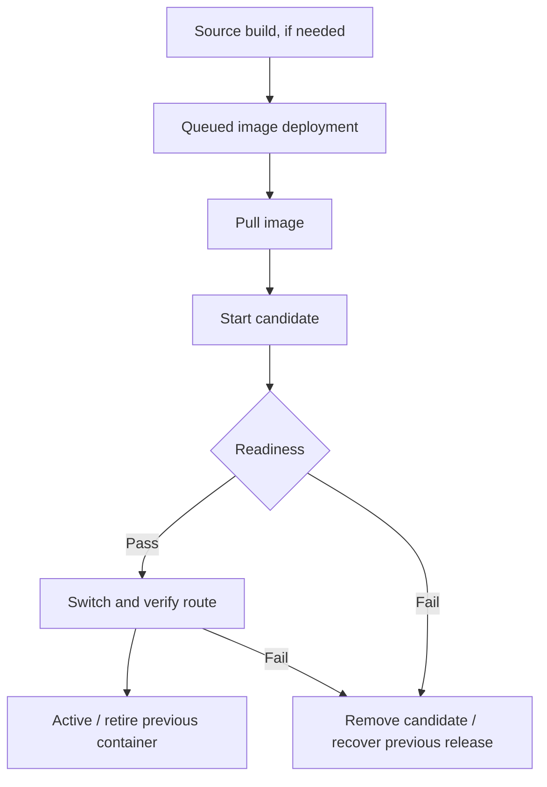

# Cloudrail user guide

This guide describes the current single-owner alpha. Start the [local quickstart](../README.md#quickstart) or complete the [VPS installer](vps-operations.md) before following these steps.

## Understand the workspace

| Concept | Purpose | Example |
| --- | --- | --- |
| Owner | Account that administers the installation | Your email/password |
| Node | Linux machine running the agent and applications | One Ubuntu VPS |
| Project | Related services grouped together | Shop |
| Environment | Separate configuration/deployment scope inside a project | staging / production |
| HTTP service | An application with a public route | web / api |
| Database service | Private PostgreSQL with persistent data | database |
| Build | Exact source commit converted to an image | GitHub SHA → digest |
| Deployment | One attempt to run an image with a saved configuration | api release 4 |

Creating staging does not clone production data or services. Create the services you need in that environment. An environment switch controls which services you are viewing; actions apply to the selected service only. The alpha has no team roles or invitation flow.

## First-time setup

1. Start Cloudrail and open the dashboard. Public installations must use HTTPS.
2. On **Create your account**, enter your email, password and password confirmation. Use at least 12 characters (maximum 72 bytes); **Show** lets you check your typing. No setup token is required.
3. Click **Create account** to enter the workspace immediately. Later visits use email/password on **Sign in**. There is no default public password.
4. Check that the **Node online** indicator appears before deploying. If it does not, use [node troubleshooting](troubleshooting.md#node-offline).

Create the account immediately after installing on a public server: the first registration becomes the installation owner. Registration closes after that account is created, including concurrent attempts.

Acceptance scripts can create a development-only owner if none exists. Their private `.data/test-owner.json` belongs to that local test installation and is not distributed with the project.

## Deploy a container image

1. Create a project and choose its environment.
2. Select **New service → Application**.
3. Click **Deploy**. Supply a full digest reference such as `traefik/whoami@sha256:...`, not a mutable tag.
4. Set the port the application actually listens on **inside its container** and a readiness path returning HTTP 2xx. For `whoami`, use `80` and `/`.
5. Submit and follow deployment activity. **Active** means the release passed activation checks; open its URL to verify your app's behavior.

Your web process must listen on `0.0.0.0`, not container loopback only. Configure secrets before deployment. A port/readiness change is applied through a new deployment.

## Deploy from GitHub

### Public repository

1. Create an HTTP service, open **Source**, and keep **Public repository** selected.
2. Enter `owner/repository`, branch and repository root (`.` for the whole repo).
3. Choose **Dockerfile** if the repository includes one; otherwise choose **Railpack**.
4. Set the Dockerfile path relative to the chosen root when applicable. Configure build/start overrides only if your application needs them.
5. Set application port/readiness, save the source, then choose **Build & deploy**.
6. Watch **Build history**, then **Deployments**. A successful build alone does not mean the application became healthy.

Example repositories exercised locally: `traefik/whoami` on `master` with a Dockerfile, and `railwayapp-templates/expressjs` on `main` with Railpack. Their branches can change upstream; select the branch that currently exists. Build history records the exact SHA used.

### Private repository and push deployment

Follow [GitHub App setup](source-builds.md#github-app): create your own App, grant Contents/Metadata read access, subscribe to push events, configure the public webhook URL and install it on selected repositories. Save its App ID, slug, private key and webhook secret in Cloudrail.

Back in **Source**, load installations, select the installed account and repository, choose the branch and enable automatic deployment. Pushes to that configured branch are signature-checked and deduplicated. The GitHub repository hosting Cloudrail itself is separate from this App integration; publishing Cloudrail does not connect your applications automatically.

Runtime variables are not available during builds. Private package build secrets are not supported in this alpha. Use only trusted repositories because the builder has privileged access to the host runtime.

## Variables and environment changes

Open the service's **Variables** tab to add/update/remove runtime variables. Saved values are encrypted, and only names are returned to the UI. Enter the replacement value when changing a secret.

Deploy again to apply changes. **Restart** reuses the current deployment's snapshot. Editing staging variables does not change a production service. Build/start command fields are not a place to store secrets.

## Read deployment state and recover

- **Queued/pulling/starting/checking/routing**: a deployment is in progress.
- **Active**: activation succeeded. Check ongoing node/container observations for current health.
- **Failed**: inspect its error and retained logs. A prior healthy release can still be serving.
- **Superseded**: a newer release replaced it.

For a failed stateless replacement, Cloudrail keeps or restores the prior serving release. To deploy an older image, select it in history and use **Redeploy image**. This creates a new deployment using the current runtime configuration; it does not restore historical variables or database contents.

Cancellation requests stop a queued job or clean up a running candidate. Existing traffic recovery is part of the cancellation flow; do not assume that clicking cancel instantly stops every subprocess.

Use **Settings → Start / Restart / Stop** for an existing deployment. To read output, choose **Runtime logs**. Logs are bounded tails, not a permanent log archive.

## Persistent storage and resource limits

Under **Settings**, choose memory/CPU limits and, if needed, one persistent volume mount path. Save and redeploy to apply them. An attached volume's identity/path cannot be changed or detached through the UI.

Persistent services stop the previous container before starting the replacement. This introduces a brief interruption and prevents two containers writing the same volume. A failed image can still have changed stored data; image rollback does not reverse those changes. Back up before incompatible schema/data updates.

## Add PostgreSQL and connect an application

1. Select **New service → PostgreSQL database** in the same project/environment as your HTTP application.
2. Wait for the private database deployment to become active. It has no public URL or published database port.
3. In its **Settings**, select the HTTP application under **Connect an application**.
4. Save the connection variable, normally `DATABASE_URL`.
5. Deploy the HTTP application again so its new container receives that variable.

The password stays hidden and the database hostname is usable only inside the private environment network. Connecting across environments is rejected. PostgreSQL initialization credentials are managed by the template, not editable as ordinary variables. The template's major version is fixed; upgrades require a separately tested migration.

## Back up and restore

For PostgreSQL, choose **Settings → Create backup**, wait for completion and download the dump. Keep an encrypted copy off the VPS. Restoring requires an **empty target database**: create a fresh PostgreSQL service, choose a compatible backup from its restore selector, and confirm restoration. Cloudrail refuses to overwrite a nonempty database. Verify your application data before using the restored database.

For an HTTP volume, stop the service first. Create/download the backup, then restore to an empty, stopped target with a volume. Volume exports are limited to 1 GB. A failed extraction can leave a partial target; preserve it for inspection and use a fresh empty target when necessary.

The dashboard restores archives retained in this installation. It does not currently offer arbitrary external dump upload. Downloading an archive off-server is a backup copy, not a complete disaster-recovery procedure. Control-plane keys/identity, registry, volumes and certificates have separate recovery requirements; read [operations](vps-operations.md#back-up-and-restore) and [release recovery](release.md#recover-a-failed-update).

## Public domains and HTTPS

On the VPS installation, use dashboard and wildcard application DNS records pointing directly to the server's public IPv4. Allow inbound 80/443. Cloudrail configures Traefik for certificate issuance/renewal.

To change an application's hostname, enter it under **Settings** after its DNS points to the server. This replaces the primary hostname. A healthy internal route does not prove public DNS or certificate issuance; verify the HTTPS URL separately. The local quickstart intentionally uses HTTP and `.localhost`.

## Next steps

Use [troubleshooting](troubleshooting.md) for failures, [VPS operations](vps-operations.md) for routine maintenance, and [release/update guidance](release.md) before upgrading. Unverified production gates are tracked in the [roadmap](ROADMAP.md).
